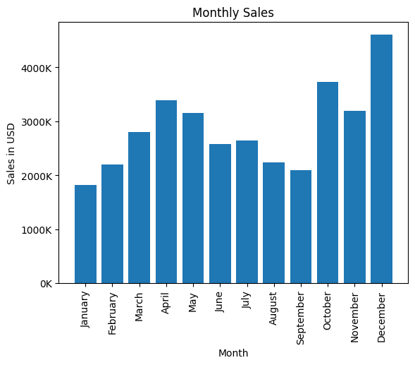
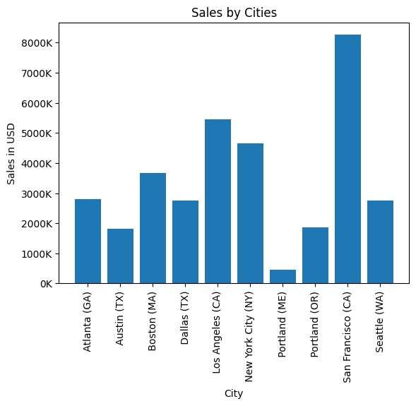
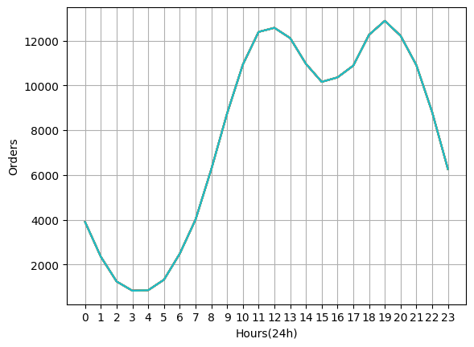
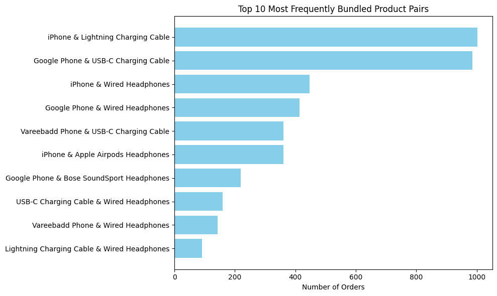
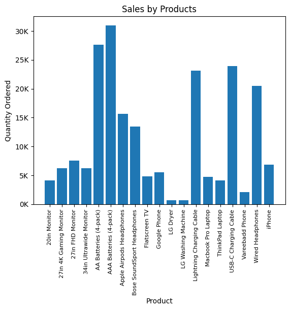
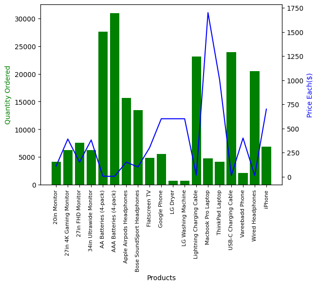

# Sales Analysis Report

This project analyzes sales data from a retail store to uncover trends and insights using Python and pandas.

## Key Findings

- **Most Profitable Month:**  
  The analysis shows that certain months, particularly in the middle of the year, generate the highest sales. This suggests a possible seasonal trend or successful promotions during those periods.

  

- **Top-Selling Cities:**  
  Sales are concentrated in a few major cities, indicating strong market presence and customer base in those locations. This insight can help target future marketing efforts.

  

- **Optimal Advertisement Timing:**  
  By analyzing order times, we identified peak hours for customer purchases. Scheduling advertisements during these hours could maximize customer engagement and sales.

  

- **Frequently Bundled Products:**  
  Some products are often purchased together, highlighting opportunities for bundle deals or cross-selling strategies.

  

- **Best-Selling Products:**  
  Certain products consistently outperform others in quantity sold. Understanding why these products are popular can inform inventory and marketing decisions.

  

- **Price vs. Quantity Relationship:**  
  Products with lower prices tend to have higher sales volumes, while higher-priced items sell less frequently. This relationship can guide pricing strategies.

  

## Insights

- **Seasonality and Promotions:**  
  Leveraging high-sales months with targeted promotions can further boost revenue.
- **City-Focused Marketing:**  
  Focusing on top-performing cities may yield better returns on marketing investments.
- **Product Bundling:**  
  Creating bundles of frequently bought-together products can increase average order value.

---

*This analysis provides actionable insights for sales, marketing, and inventory planning. For more details, see the [code](notebook.ipynb) and visualizations in notebook